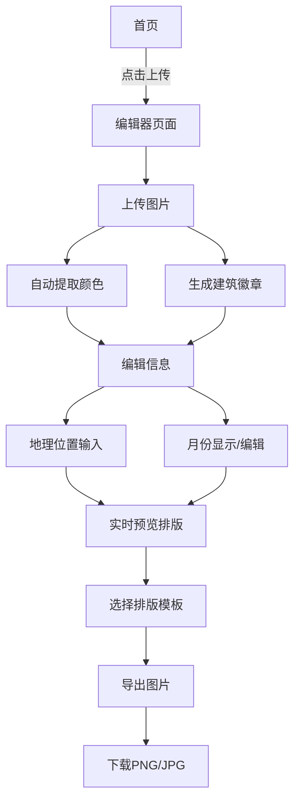

# Color Walk 图片排版工具 - 产品需求文档

## 1. 产品概述
Color Walk 图片排版工具是一款帮助用户将旅行照片快速生成小红书风格排版图片的在线工具。用户上传图片后，工具自动提取图片主体颜色、生成建筑徽章，并添加地理位置和月份信息，一键生成精美的分享图片。

## 2. 核心功能

### 2.1 用户角色

| 角色 | 注册方式 | 核心权限 |
|------|----------|----------|
| 访客用户 | 无需注册 | 上传图片、编辑排版、导出图片 |

### 2.2 功能模块

本产品包含以下核心页面：

1. **首页**：工具介绍、上传入口、示例展示。
2. **编辑器页面**：图片上传、颜色提取、徽章生成、信息编辑、实时预览、图片导出。

### 2.3 页面详情

| 页面名称 | 模块名称 | 功能描述 |
|----------|----------|----------|
| 首页 | Hero区域 | 展示工具核心价值主张，配有动态示例展示 |
| 首页 | 上传入口 | 点击跳转至编辑器页面，支持拖拽上传提示 |
| 首页 | 示例展示 | 展示3-4张生成的Color Walk风格示例图片 |
| 首页 | 使用说明 | 简要说明使用步骤：上传→编辑→导出 |
| 编辑器 | 图片上传区 | 支持点击上传和拖拽上传，支持JPG/PNG格式，单张图片限制10MB |
| 编辑器 | 颜色提取模块 | 自动提取图片主色调（3-5个色块），支持手动调整颜色 |
| 编辑器 | 徽章生成模块 | 自动识别图片中的建筑主体并生成徽章图标，支持手动选择徽章样式（圆形/方形/六边形） |
| 编辑器 | 信息编辑区 | 输入地理位置（文本输入）、自动显示当前月份（可手动修改） |
| 编辑器 | 排版预览区 | 实时预览生成的Color Walk风格排版效果，支持切换排版模板 |
| 编辑器 | 导出功能 | 支持下载PNG/JPG格式图片，分辨率可选（1x/2x） |
| 编辑器 | 重置功能 | 一键清空所有编辑内容，重新上传 |

## 3. 核心流程

用户使用流程：
1. 用户访问首页，了解工具功能
2. 点击上传按钮进入编辑器
3. 上传旅行照片
4. 系统自动提取图片主色调和建筑徽章
5. 用户输入地理位置信息，确认/修改月份
6. 选择喜欢的排版模板
7. 微调颜色、徽章样式等细节
8. 预览满意后导出图片

## 4. 用户界面设计

### 4.1 设计风格

- **主色调**：白色背景 + 提取的图片主色调作为点缀
- **辅助色**：深灰色(#333333)用于文字，浅灰色(#F5F5F5)用于背景区块
- **按钮样式**：圆角矩形(8px圆角)，主按钮使用提取的主色调
- **字体**：中文使用"PingFang SC"或"Microsoft YaHei"，英文使用"Inter"
- **字号**：标题24-32px，正文14-16px，辅助信息12px
- **布局风格**：卡片式布局，左侧编辑面板，右侧实时预览
- **图标风格**：线性图标，2px描边，圆角端点

### 4.2 页面设计概述

| 页面名称 | 模块名称 | UI元素 |
|----------|----------|--------|
| 首页 | Hero区域 | 全屏渐变背景(淡紫到淡粉)，大标题居中，CTA按钮使用渐变色 |
| 首页 | 上传入口 | 大尺寸虚线边框上传区域，hover时显示上传图标动画 |
| 首页 | 示例展示 | 横向滚动卡片，每张卡片展示示例图和模板名称 |
| 编辑器 | 左侧边栏 | 固定宽度320px，白色背景，分区块展示各编辑模块 |
| 编辑器 | 图片上传区 | 虚线边框拖拽区域，支持点击选择文件，显示文件大小限制提示 |
| 编辑器 | 颜色提取模块 | 色块网格展示(3-5个)，每个色块可点击编辑，显示HEX值 |
| 编辑器 | 徽章生成模块 | 徽章预览图 + 样式选择器(圆形/方形/六边形单选按钮) |
| 编辑器 | 信息编辑区 | 地理位置输入框(带地点图标)、月份选择器(下拉或数字输入) |
| 编辑器 | 排版预览区 | 居中展示，模拟手机/卡片比例，支持缩放查看 |
| 编辑器 | 导出按钮 | 底部固定，主色调填充，白色文字，hover时轻微上浮阴影 |

### 4.3 响应式设计

- **桌面优先**：主要面向桌面端用户，编辑器采用左右分栏布局
- **平板适配**：平板设备上左侧编辑面板可折叠，点击展开
- **移动端**：简化编辑器，采用上下布局，预览区在上，编辑区在下

### 4.4 Color Walk排版样式规范

生成的排版图片包含以下元素：

- **背景**：提取的主色调作为背景色块
- **主图**：用户上传的旅行照片，占据主要视觉区域
- **徽章**：建筑主体提取后生成的圆形/方形徽章，叠加在主图角落
- **地理位置**：底部显示地点名称，使用大写字母，简洁字体
- **月份**：显示拍摄月份(如"MAY")，与地点信息配合展示
- **整体风格**：留白充足，色彩明快，现代简约

排版模板选项：
1. **经典模板**：主图居中，色块背景，徽章右上角
2. **左右分割**：左侧色块+地点信息，右侧主图
3. **上下布局**：顶部主图，底部色块条带+徽章+信息
