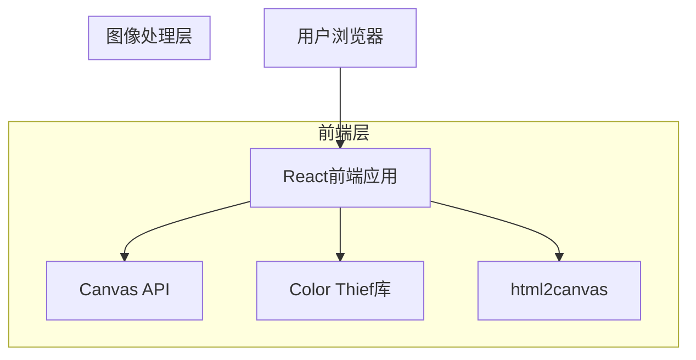

# Color Walk 图片排版工具 - 技术架构文档

## 1. 架构设计



## 2. 技术描述

- **前端框架**: React@18 + TypeScript
- **样式方案**: TailwindCSS@3
- **构建工具**: Vite
- **图像处理**: 
  - Color Thief (提取图片主色调)
  - html2canvas (DOM转图片导出)
  - Canvas API (自定义图像处理)
- **UI组件库**: 自定义组件
- **状态管理**: React Hooks (useState, useReducer)
- **文件处理**: 原生File API
- **后端**: 无 (纯前端实现)

## 3. 路由定义

| 路由 | 用途 |
|------|------|
| / | 首页，展示工具介绍和上传入口 |
| /editor | 编辑器页面，图片处理和排版功能 |

## 4. 核心功能实现方案

### 4.1 颜色提取

使用 Color Thief 库提取图片主色调：

```typescript
// 获取图片主色调
const colorThief = new ColorThief();
const dominantColor = colorThief.getColor(imageElement);
const palette = colorThief.getPalette(imageElement, 5);
```

### 4.2 建筑徽章生成

采用Canvas裁剪方案：
1. 用户手动框选建筑区域
2. 使用Canvas裁剪选中区域
3. 应用圆形/方形/六边形遮罩
4. 添加边框和阴影效果

### 4.3 图片导出

使用 html2canvas 将排版DOM转换为图片：

```typescript
import html2canvas from 'html2canvas';

const exportImage = async (element: HTMLElement) => {
  const canvas = await html2canvas(element, {
    scale: 2, // 2倍分辨率
    backgroundColor: null,
    useCORS: true
  });
  
  const link = document.createElement('a');
  link.download = 'color-walk.png';
  link.href = canvas.toDataURL('image/png');
  link.click();
};
```

## 5. 数据结构定义

### 5.1 类型定义

```typescript
// 颜色类型
interface ColorPalette {
  dominant: [number, number, number]; // RGB
  palette: [number, number, number][]; // 色板
}

// 徽章类型
interface Badge {
  imageData: string; // base64
  shape: 'circle' | 'square' | 'hexagon';
  position: { x: number; y: number };
}

// 排版信息
interface LayoutInfo {
  location: string;
  month: string;
  template: 'classic' | 'split' | 'vertical';
}

// 项目状态
interface EditorState {
  originalImage: string | null;
  colors: ColorPalette | null;
  badge: Badge | null;
  layoutInfo: LayoutInfo;
}
```

### 5.2 排版模板配置

```typescript
const TEMPLATES = {
  classic: {
    name: '经典模板',
    backgroundColor: 'var(--dominant-color)',
    imagePosition: 'center',
    badgePosition: 'top-right',
    infoPosition: 'bottom'
  },
  split: {
    name: '左右分割',
    layout: 'flex-row',
    leftWidth: '40%',
    rightWidth: '60%'
  },
  vertical: {
    name: '上下布局',
    layout: 'flex-col',
    topHeight: '70%',
    bottomHeight: '30%'
  }
};
```

## 6. 组件架构

```
src/
├── components/
│   ├── common/
│   │   ├── Button.tsx
│   │   ├── ColorPicker.tsx
│   │   └── Icon.tsx
│   ├── editor/
│   │   ├── ImageUploader.tsx      # 图片上传组件
│   │   ├── ColorExtractor.tsx     # 颜色提取展示
│   │   ├── BadgeGenerator.tsx     # 徽章生成器
│   │   ├── LocationInput.tsx      # 地理位置输入
│   │   ├── MonthSelector.tsx      # 月份选择
│   │   ├── TemplateSelector.tsx   # 模板选择
│   │   └── PreviewCanvas.tsx      # 预览画布
│   └── home/
│       ├── Hero.tsx
│       ├── ExampleGallery.tsx
│       └── UploadCTA.tsx
├── hooks/
│   ├── useImageUpload.ts          # 图片上传逻辑
│   ├── useColorExtraction.ts      # 颜色提取hook
│   └── useImageExport.ts          # 图片导出逻辑
├── utils/
│   ├── colorUtils.ts              # 颜色处理工具
│   ├── canvasUtils.ts             # Canvas操作工具
│   └── imageProcessing.ts         # 图像处理工具
├── types/
│   └── index.ts
├── pages/
│   ├── Home.tsx
│   └── Editor.tsx
└── App.tsx
```

## 7. 关键技术点

### 7.1 图片处理性能优化

- 上传图片时压缩至最大2000px宽度
- 使用 Web Worker 处理颜色提取（如需要）
- 预览时使用压缩后的图片，导出时使用原图

### 7.2 徽章生成流程

1. 用户上传图片后显示在Canvas上
2. 提供框选工具让用户选择建筑区域
3. 裁剪选中区域并应用遮罩效果
4. 生成徽章预览

### 7.3 实时预览实现

- 使用React state管理所有编辑状态
- 预览组件监听state变化重新渲染
- 使用CSS变量动态应用提取的颜色

## 8. 依赖列表

```json
{
  "dependencies": {
    "react": "^18.2.0",
    "react-dom": "^18.2.0",
    "color-thief-react": "^2.1.0",
    "html2canvas": "^1.4.1",
    "lucide-react": "^0.300.0"
  },
  "devDependencies": {
    "@types/react": "^18.2.0",
    "@types/react-dom": "^18.2.0",
    "@vitejs/plugin-react": "^4.2.0",
    "autoprefixer": "^10.4.0",
    "postcss": "^8.4.0",
    "tailwindcss": "^3.4.0",
    "typescript": "^5.3.0",
    "vite": "^5.0.0"
  }
}
```
